# Lab 1 Design Document 

## Design Decisions

Our intial mockup for our design is shown below:

<!--  -->
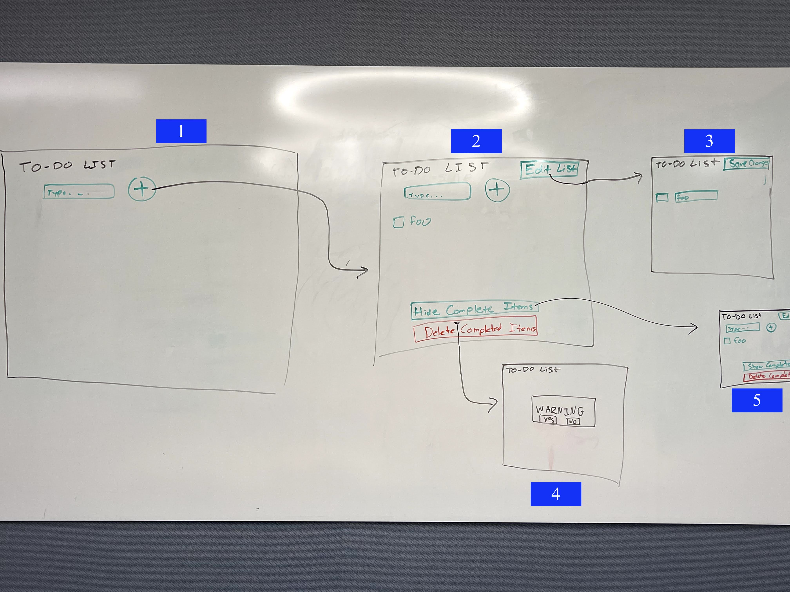

Picture (1) is what the empty to-do list would look like. For the empty list we want to add constraints by hiding all the actions other than adding an item to the list. This simplifies the experience for the user and also avoids errors of them potentially trying to edit, delete, or hide non-existent items of the list. Additionally, it highlights the only available action, of adding tasks to the list.

Picture (2) shows what the to-do list would like like after at least one task is added. With tasks on the to-do list, the user should be able to check them off, edit the names of the list, and hide/delete completed items. We want to group the "Edit List" button near the button to add items to the list because they serve similar functions. Similarly, we group the "Hide Completed Items" and "Delete Completed Items" buttons because they serve a similar purpose. However, we want the "Delete Completed Items" to be red because it is a permanent and potentially harmful action than any of the other buttons.

Picture (3) shows what happens if the user presses "Edit List". At this point, the field and button to add new items from the list, as well as the hide and delete buttons, disappear to indicate that the purpose of this button is to edit existing items on the to-do list. The label of this button also changes to "Save Changes".

Picture (4) depicts what happens if the user pressed "Delete Completed Items". This opens up a warning screen over the list, informing the user that they are about to permanently delete completed tasks. It asks the user to confirm or deny that this is the desired action.

Picture (5) shows what the list looks like after the "Hide Completed Items" button is pressed. The layout remains unchanged, except the button changes from "Hide Completed Items" to "Show Completed Items".

## Alternative Design Considerations

The main alternative design choice that we discussed was automatically moving completed
items to the bottom of the list. The thought behind this was that uncompleted items would
likely be more important to the user, and if they happened to have a long list then it might be 
frustrating to have to scroll through all of the completed items. However, we decided that having the
option to hide the completed items handled this case. Here is a screenshot of what 
this would have looked like:

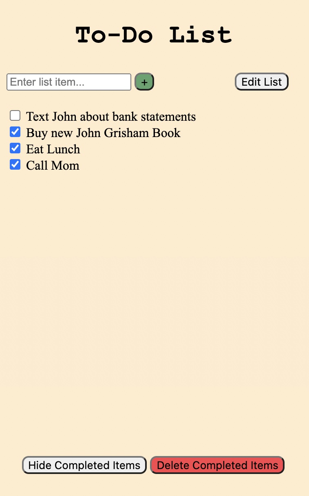

## User Testing

For user testing, we showed the screenshots in the following section to a friend and asked them how they would complete each task. We found that for each task and at each stage, our design lined up with what the user expected.

## Final Design

Below we see what the empty list looks like.

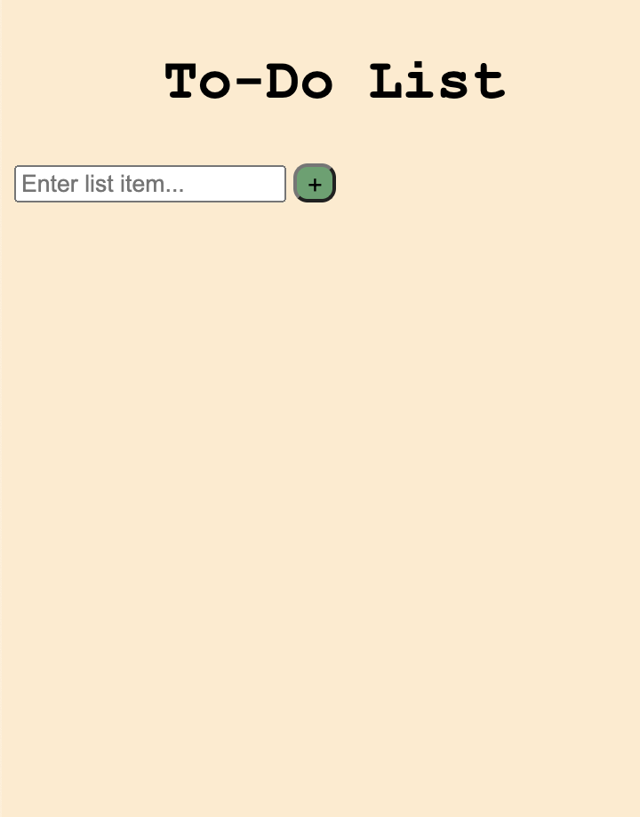

This is what the user would see if they entered one item into the list, "Buy new John Grisham book" and added it to the list.

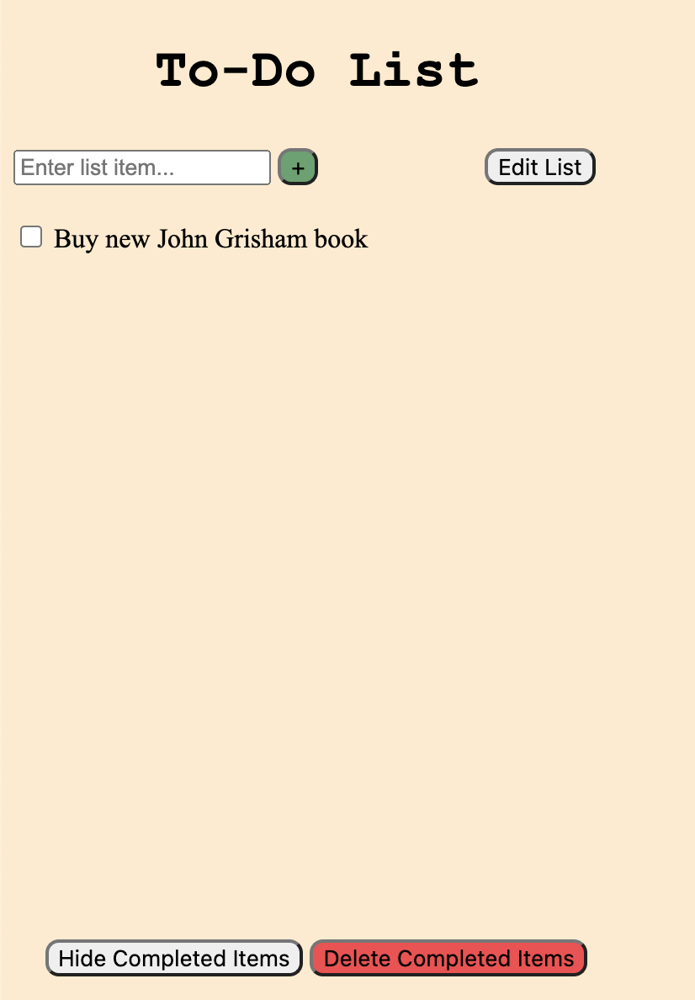

From the above non-empty list, adding a second item, "Eat Lunch," would look like this.

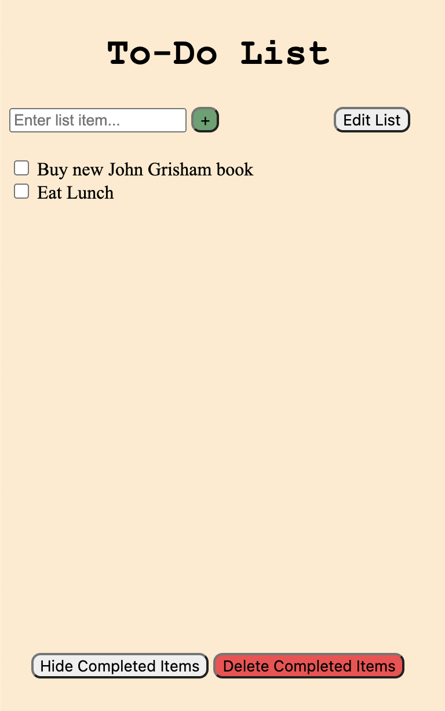

Below we have a picture of what the list would look like with one task titled "Call Mom."

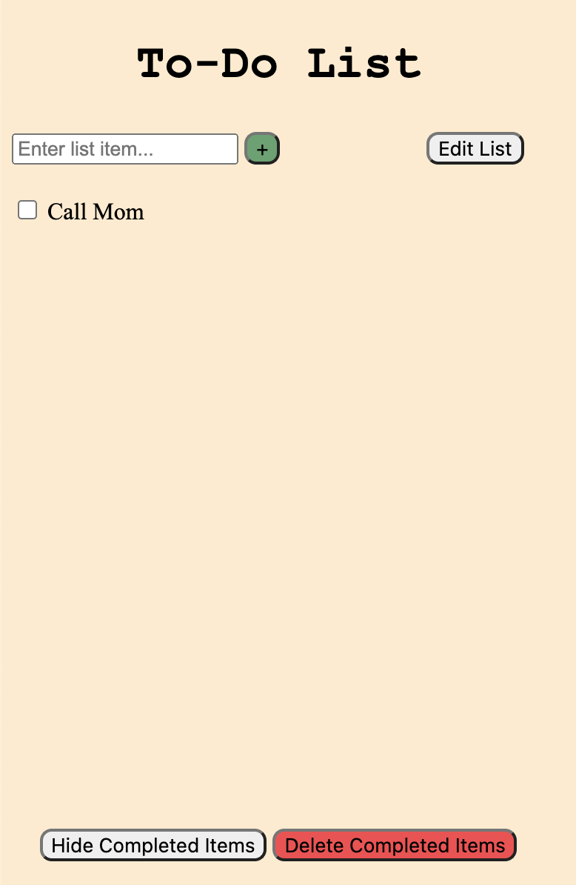

If the user clicked on the checkbox or its label, this is now what the screen would display.

If a user had a list titled "Text John," this is what they would see.

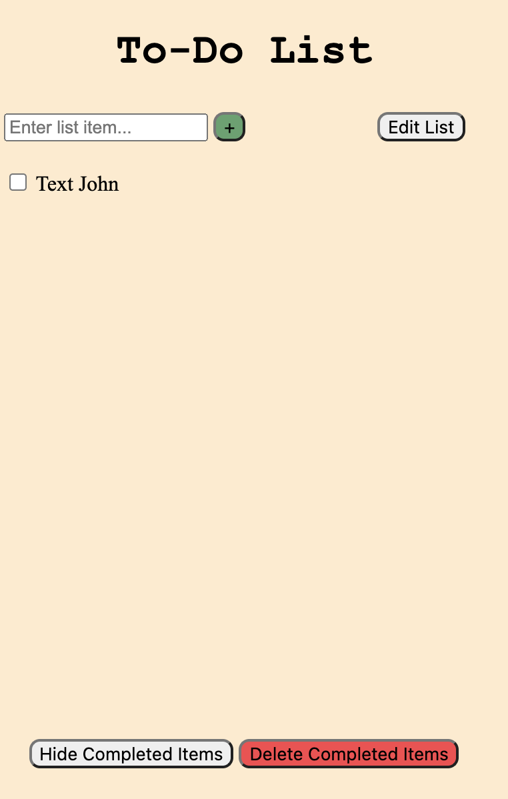

If they wanted to rename "Text John," they would press "Edit List" and would be presented with the below screen. The checkbox turns into an editable text box and the button changes from "Edit List" to "Save Changes."

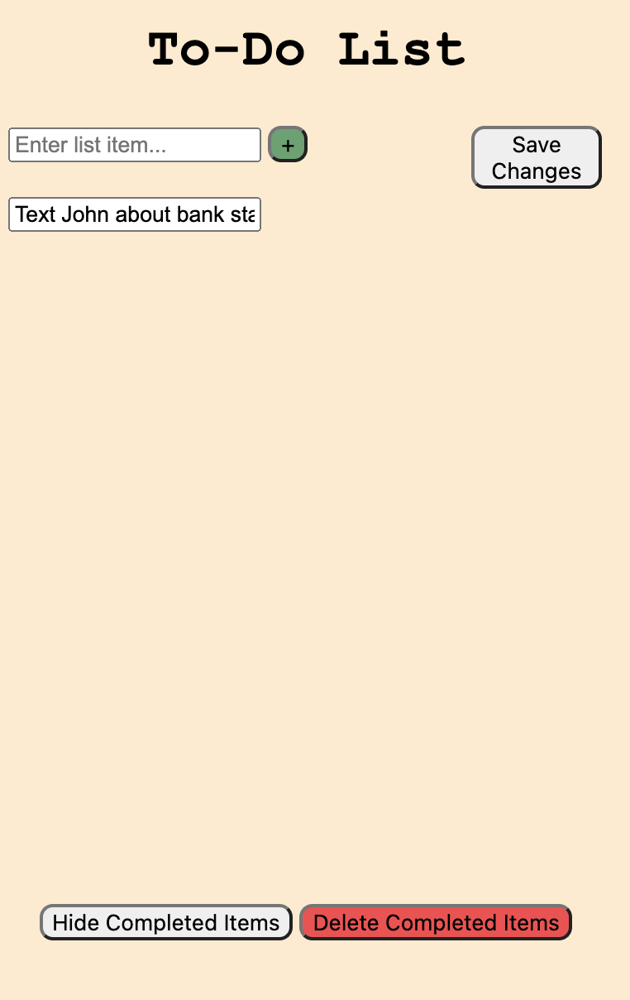

Then, when they press "Save Changes" they would be presented with the default list view, as shown below.

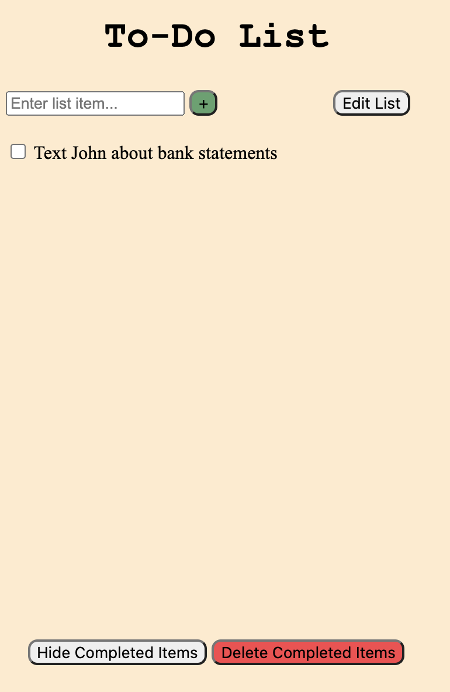

If a user had a list of multiple items, some of which had been marked complete, they would see the following.

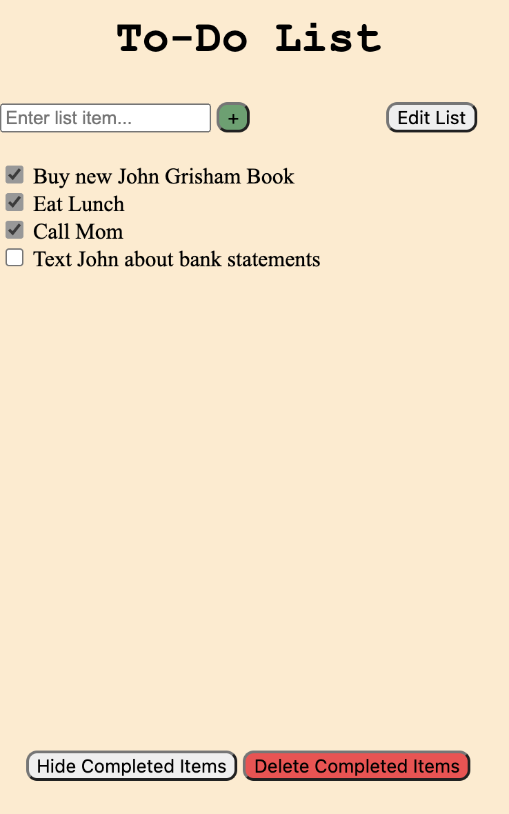

If they pressed the "Hide Completed Items" button at the bottom of the screen, the would see the following. Notice that the button changes to say "Show Completed Items."

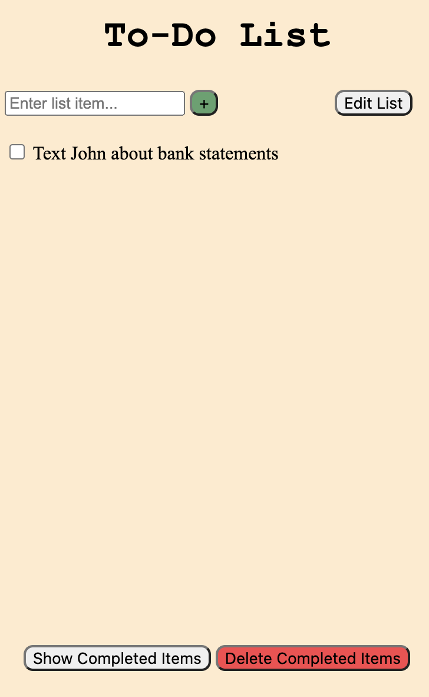

If a user had a list of multiple items, some of which had been marked complete, they would see the following.

If they clicked the "Delete Completed Items" button, they would be presented with the following warning screen.

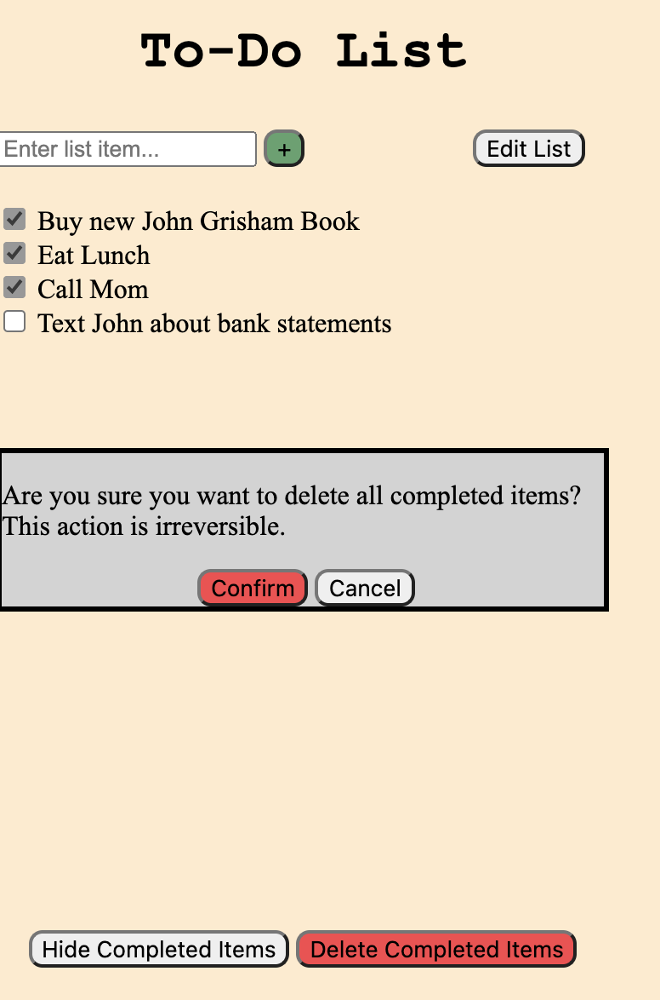

After pressing confirm, they would be presented with a list with only the uncompleted items, like the one below.

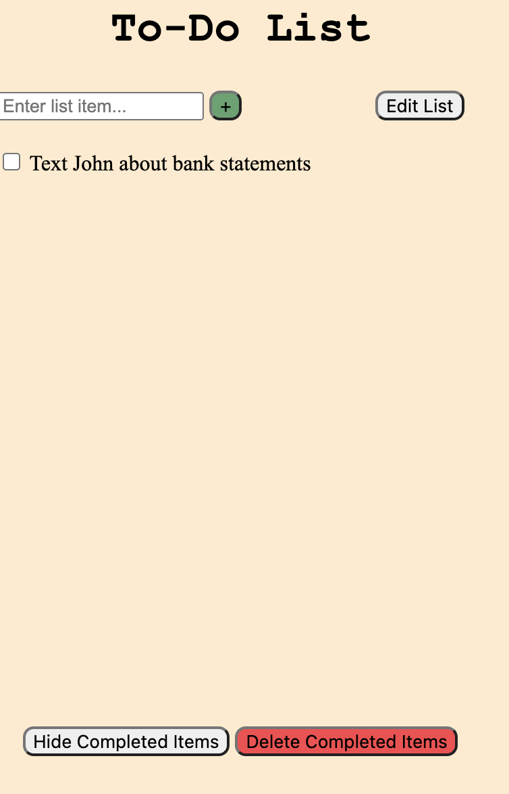

## Challenges

One challenge we came across was deciding how to facilitate editing of the list items. One possibility was to 
mimic the behaviour of the Apple Notes app, where you can click on the items at any time and have the keyboard and cursor appear.
However, we wanted to have a designated button so that the user would know that it was possible. This is how we ended adding the 
"Edit List" button.

Another challenge we faced was deciding what deleting completed items should look like. We knew that we couldn't simply
delete them with only one prompt from the user (i.e., clicking the "Delete" button once). After some consideration, we decided
on including a pop-up window that asks the user to confirm their intent on deleting the completed items after they hit the button. We also made
the "Delete" button red as an indication of its function.

## Pride Points

We are most proud of the flow for deleting completed items. We put some thought
into this flow, and as a result made the "delete" button red and created
a pop-up window so that the user would have to confirm that they really wanted to delete their items.

We are also proud of our user testing. When we asked a couple of friends how they would go about
adding items, editing their names, hiding completed items, and deleting completed items, they
followed the exact steps that we had in mind during our design.
