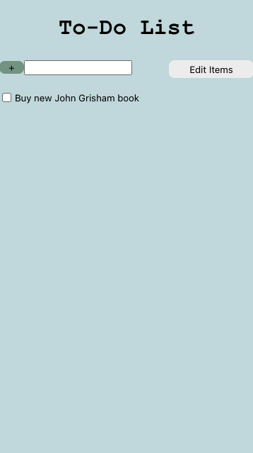
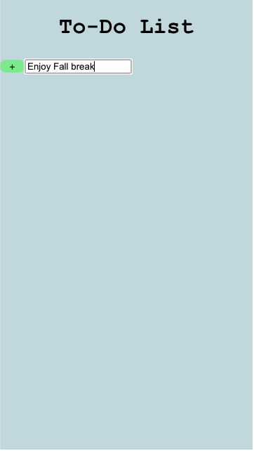
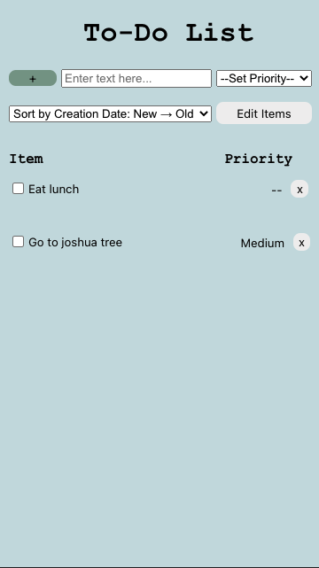
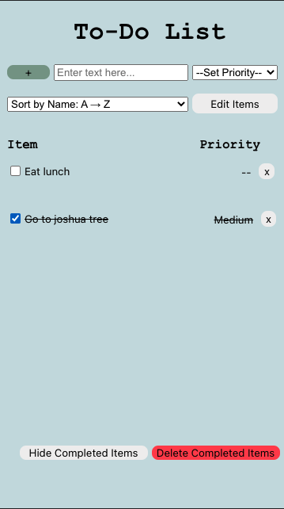
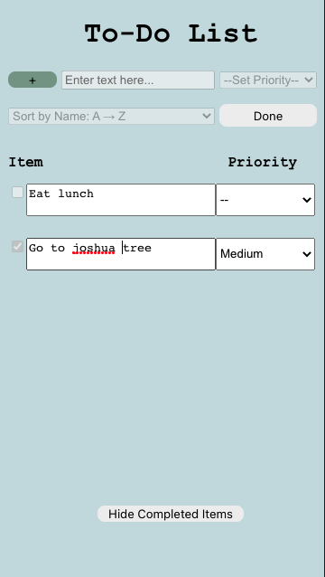
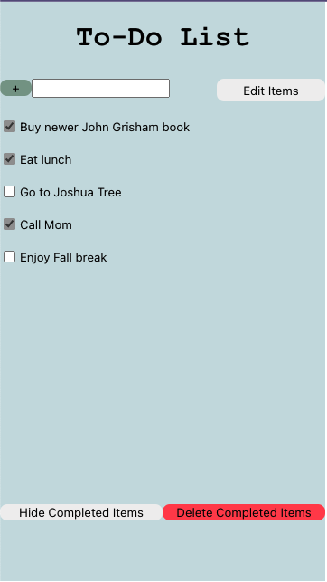
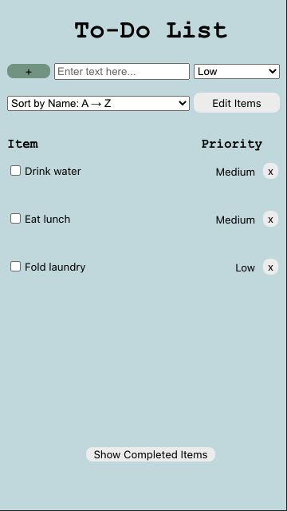
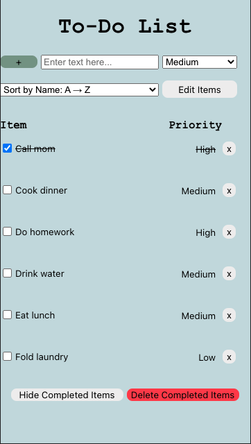
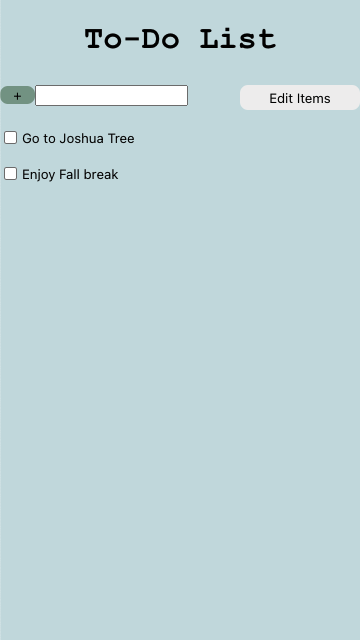

# Lab 2 Design Document 

## Design Decisions

Our intial mockup for our design is shown below:

<!--  -->

Picture (1) is what the empty to-do list would look like. For the empty list we want to add constraints by hiding all the actions other than adding an item to the list. This simplifies the experience for the user and also avoids errors of them potentially trying to edit, delete, or hide non-existent items of the list. Additionally, it highlights the only available action, of adding tasks to the list.

Picture (2) shows what the to-do list would like like after at least one task is added. With tasks on the to-do list, the user should be able to check them off, edit the names of the list, and hide/delete completed items. We want to group the "Edit List" button near the button to add items to the list because they serve similar functions. Similarly, we group the "Hide Completed Items" and "Delete Completed Items" buttons because they serve a similar purpose. However, we want the "Delete Completed Items" to be red because it is a permanent and potentially harmful action than any of the other buttons.

Picture (3) shows what happens if the user presses "Edit List". At this point, the field and button to add new items from the list, as well as the hide and delete buttons, disappear to indicate that the purpose of this button is to edit existing items on the to-do list. The label of this button also changes to "Save Changes".

Picture (4) depicts what happens if the user pressed "Delete Completed Items". This opens up a warning screen over the list, informing the user that they are about to permanently delete completed tasks. It asks the user to confirm or deny that this is the desired action.

Picture (5) shows what the list looks like after the "Hide Completed Items" button is pressed. The layout remains unchanged, except the button changes from "Hide Completed Items" to "Show Completed Items".

## Alternative Design Considerations

The main alternative design choice that we discussed was automatically moving completed items to the bottom of the list. The thought behind this was that uncompleted items would likely be more important to the user, and if they happened to have a long list then it might be frustrating to have to scroll through all of the completed items. However, we decided that having the option to hide the completed items handled this case.

## User Testing

For user testing, we showed the application to two friends and had them interact with the interface without any guidance. We found that for each task and at each stage, our design lined up with what the user expected and there were no usability concerns. We observed that our implementation of dimming the inputs on edit mode was appreciated. Additionally, people found the descriptions of the sorting drop-down and its design/layout on the screen to be understandable.

## Final Design

Below we see what the empty list looks like. The add button is dimmed when there is no input in the textbox. Notably what is different now from the previous iteration is that the empty textbox now prompts the user to enter text and there is also a drop down menu for the user to select the priority of tasks they are going to add.

As before, now that there is input to the textbox, the add button brightens to notify the user that they can add the item.

This is what the user would see if they entered one item into the list, "Go to Joshua Tree" and added it to the list. Compared to our previous design this is very different. For one, there is now a header that labels the actual item and a header that labels its priority for the user to understand what they represent. Additionally, there is now the ability to directly delete that single item by clicking on the "x" button. This allows users to delete individual items from the list without worrying about disrupting their list of completed items. Finally, here we can see that there is now a dropdown menu to sort items in the list, by name, creation date, and priority. 

If a user adds an item to the list without selecting its priority, the following is what they would see.

If a user clicks on the checkbox or its label for an item in the list, we not only display buttons for hiding or deleting completed items as before, but the item is now also crossed out, as shown below.

If the user wanted to rename "Eat Lunch," they would press "Edit Items" and would be presented with the below screen. The checkbox turns into an editable text box and the button changes from "Edit Items" to "Done." Previously, this button said "Save Changes" but this was not accurate as the changes are continuously being saved, so we decided to change the button's label. In this edit screen, they can now also edit the priority of the item. A notable change from our previous iteration is that now, all of the inputs for creating a new item - the add button, the input text field, and the priority dropdown - are all disabled, as is the sorting drop down, and the checkboxes for each item. In the previous iteration users could add items to the list while in edit mode, but in our user testing, we discovered that this was confusing and so we disabled all inputs to create a new list item. Additionally, we believe that sorting the list while in edit mode would be confusing and so we decided to disable it. In our previous design, marking any item as complete was disabled but there was no visual indication for this, and so in this iteration we dim and disable the checkboxes in edit mode. Finally, we have removed the button to delete all completed items from the list while in edit mode, so as to create constraints and not overwhelm the user with possible actions.

Then, when they press "Done" they would be presented with the default list view.

If a user had a list of multiple items, some of which had been marked complete, they would see the following.

If they then pressed the "Hide Completed Items" button at the bottom of the screen, the would see the following. Notice that the button changes to say "Show Completed Items." The elements that get hidden fade out of view instead of disappear immediately, which helps the user understand where these list items are going. In this iteration, we have decided to remove the "Delete Completed Items" button while completed items are being hidden. This prevents the user from accidentally deleting items they did not intend to since they cannot see what they are deleting.

We have not made any changes to the flow once a user presses "Delete Completed Items."

One visual change made from the previous iteration is that now if a user has many items on the list, they can scroll through them. Previously, the buttons to hide and delete completed items would get pushed off the screen, but now they are fixed and the list is scrollable, as shown in the two images below.

## Challenges
A significant challenge that we faced in this version of our application was getting the sorting functionality to work as intended. Particularly, we discovered that when attempting to sort by priority, Firestore was only able to do an alphnumerical sorting of the three priority levels - high, medium, and low - and so they did not sort in the way we intended. To solve this, the priority attribute is actually an object with a key/value pair. We display the values, which are high, medium, and low, and we sort by the keys, which are just characters assigned such that they sort in the intended fashion. 

One challenge that we were unable to solve, for a similar reason, was that when in edit mode, changes to the list item would cause the items to move around depending on the sorting preference. We attempted to store the order of list items when the user presses the edit button and sort by this order, but again due to Firestore's necessity of sorting alphanumerical sorting, we were unable to create a custom sorting function that would allow us to accomplish this. 

## Pride Points

We are most proud of our thoughtfulness and incorporation of ideas as to how a user would actually want to interact with this product. For example, the user can select a priority for a task when creating it, but they are not forced to do so. The attention to detail in ensuring that the menu elements in the top two rows are all aligned are also things we are proud of.

We are proud of the flow for deleting  items. We put some thought into this flow, and as a result made the "Delete all Completed Items" button red and created a pop-up window so that the user would have to confirm that they really wanted to delete their items. Additionally, when the user deletes or hides completed items, they slowly fade out rather than immediately disappearing. Moreover, on the desktop, if a user highlights over the X button to delete an item, it turns red just as the delete all completed items button is, which creates a unified design language that is understandable. 

We are also proud of our user testing. When we asked a couple of friends how they would go about adding items, editing their names, hiding completed items, and deleting completed items, they followed the exact steps that we had in mind during our design.
