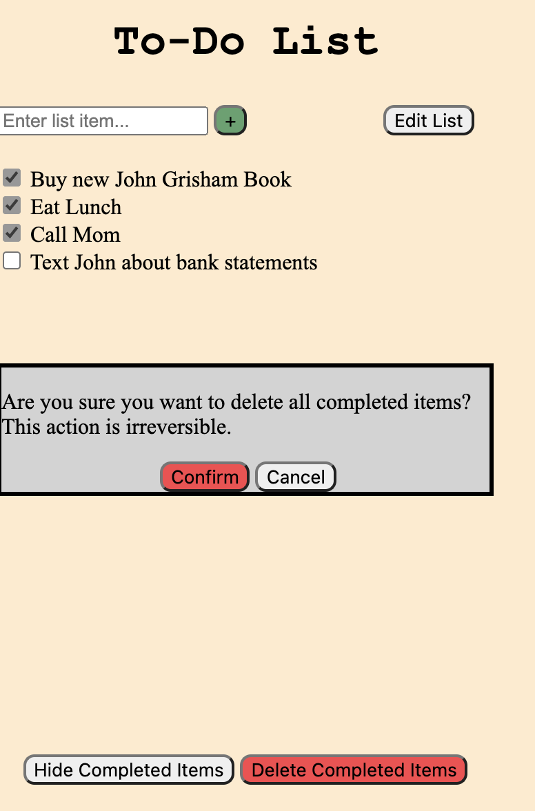
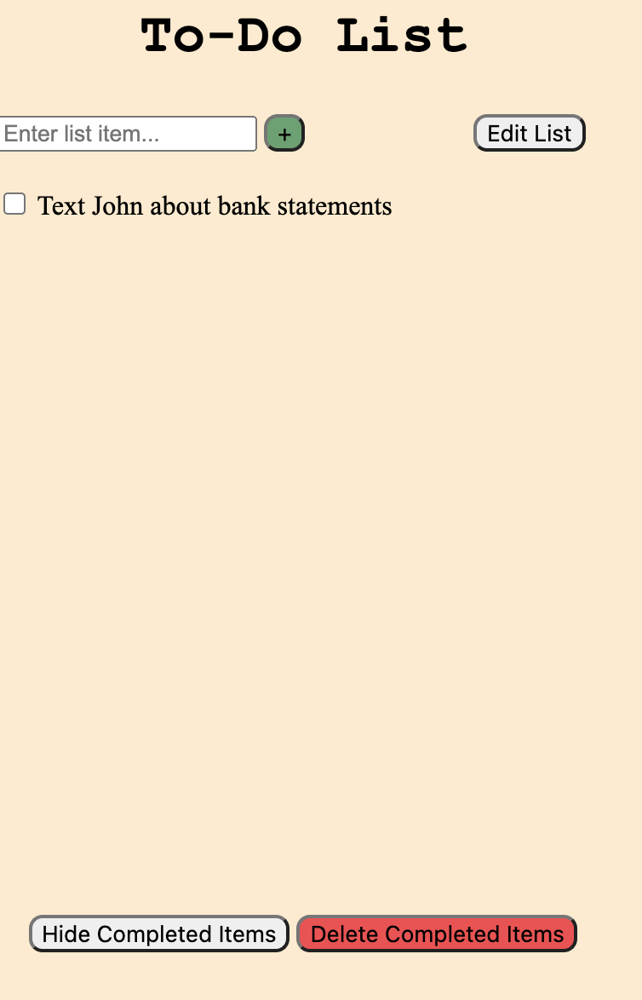

# Lab 1 Design Document 

## Design Decisions

Our intial mockup for our design is shown below:

<!--  -->

Picture (1) is what the empty to-do list would look like. For the empty list we want to add constraints by hiding all the actions other than adding an item to the list. This simplifies the experience for the user and also avoids errors of them potentially trying to edit, delete, or hide non-existent items of the list. Additionally, it highlights the only available action, of adding tasks to the list.

Picture (2) shows what the to-do list would like like after at least one task is added. With tasks on the to-do list, the user should be able to check them off, edit the names of the list, and hide/delete completed items. We want to group the "Edit List" button near the button to add items to the list because they serve similar functions. Similarly, we group the "Hide Completed Items" and "Delete Completed Items" buttons because they serve a similar purpose. However, we want the "Delete Completed Items" to be red because it is a permanent and potentially harmful action than any of the other buttons.

Picture (3) shows what happens if the user presses "Edit List". At this point, the field and button to add new items from the list, as well as the hide and delete buttons, disappear to indicate that the purpose of this button is to edit existing items on the to-do list. The label of this button also changes to "Save Changes".

Picture (4) depicts what happens if the user pressed "Delete Completed Items". This opens up a warning screen over the list, informing the user that they are about to permanently delete completed tasks. It asks the user to confirm or deny that this is the desired action.

Picture (5) shows what the list looks like after the "Hide Completed Items" button is pressed. The layout remains unchanged, except the button changes from "Hide Completed Items" to "Show Completed Items".

## Alternative Design Considerations

## User Testing

For user testing, we showed the screenshots in the following section to a friend and asked them how they would complete each task. We found that for each task and at each stage, our design lined up with what the user expected.

## Final Design

Below we see what the empty list looks like.

This is what the user would see if they entered one item into the list, "Buy new John Grisham book" and added it to the list.

From the above non-empty list, adding a second item, "Eat Lunch," would look like this.

Below we have a picture of what the list would look like with one task titled "Call Mom."

If the user clicked on the checkbox or its label, this is now what the screen would display.

If a user had a list titled "Text John," this is what they would see.

If they wanted to rename "Text John," they would press "Edit List" and would be presented with the below screen. The checkbox turns into an editable text box and the button changes from "Edit List" to "Save Changes."

Then, when they press "Save Changes" they would be presented with the default list view, as shown below.

If a user had a list of multiple items, some of which had been marked complete, they would see the following.

If they pressed the "Hide Completed Items" button at the bottom of the screen, the would see the following. Notice that the button changes to say "Show Completed Items."

If a user had a list of multiple items, some of which had been marked complete, they would see the following.

If they clicked the "Delete Completed Items" button, they would be presented with the following warning screen.

After pressing confirm, they would be presented with a list with only the uncompleted items, like the one below.

## Challenges

## Pride Points