# Lab 4 Design Document 

## Design Decisions

Our intial mockup for our design is shown below:

<!--  -->
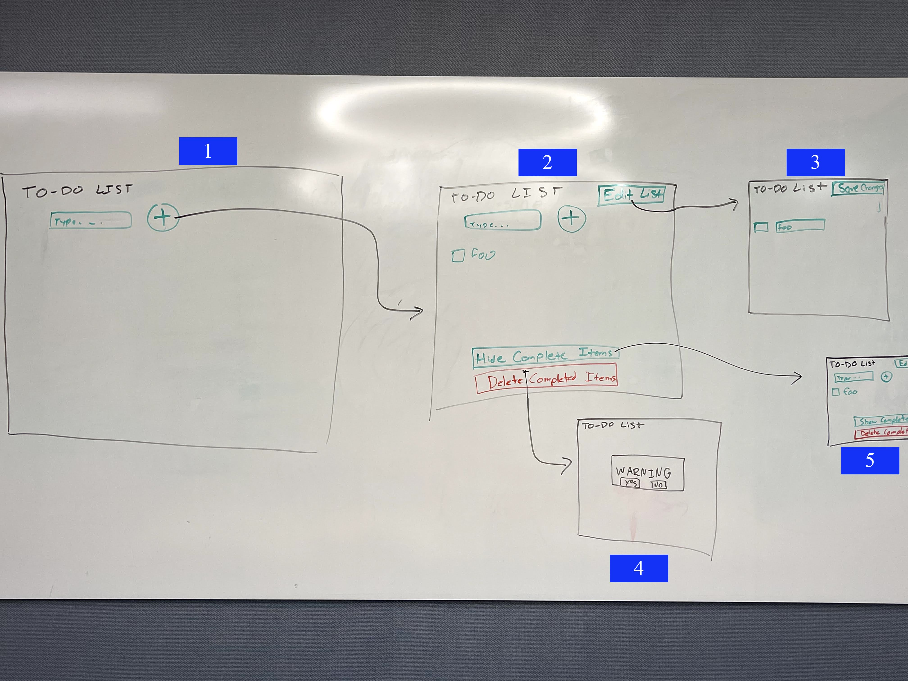

Picture (1) is what the empty to-do list would look like. For the empty list we want to add constraints by hiding all the actions other than adding an item to the list. This simplifies the experience for the user and also avoids errors of them potentially trying to edit, delete, or hide non-existent items of the list. Additionally, it highlights the only available action, of adding tasks to the list.

Picture (2) shows what the to-do list would like like after at least one task is added. With tasks on the to-do list, the user should be able to check them off, edit the names of the list, and hide/delete completed items. We want to group the "Edit List" button near the button to add items to the list because they serve similar functions. Similarly, we group the "Hide Completed Items" and "Delete Completed Items" buttons because they serve a similar purpose. However, we want the "Delete Completed Items" to be red because it is a permanent and potentially harmful action than any of the other buttons.

Picture (3) shows what happens if the user presses "Edit List". At this point, the field and button to add new items from the list, as well as the hide and delete buttons, disappear to indicate that the purpose of this button is to edit existing items on the to-do list. The label of this button also changes to "Save Changes".

Picture (4) depicts what happens if the user pressed "Delete Completed Items". This opens up a warning screen over the list, informing the user that they are about to permanently delete completed tasks. It asks the user to confirm or deny that this is the desired action.

Picture (5) shows what the list looks like after the "Hide Completed Items" button is pressed. The layout remains unchanged, except the button changes from "Hide Completed Items" to "Show Completed Items".

## Alternative Design Considerations

The main alternative design choice that we discussed was with regards to how the user should be able to log out when on a smaller, or mobile, device. On the larger view, we show the user's email with a drop down to log out and/or verify their account, however this is too much information for smaller screens. As a result we were unsure whether or not to keep the drop down in the smaller view, and ultimately decided to simply display the buttons. The user is unable to see their email in this view, however.

We also considered allowing shared users to delete lists but ultimately decided that this control should only be enabled for list owners.

## User Testing

For user testing, we showed the application to a few friends of ours and asked them to create an account and create a few lists and share them with us. We focused our user testing on signing up and sharing lists, as these were the main new features we added. We identified that users were able to successfully create an account without any issues. When sharing, we observed that one user attempted to share a list with the same account multiple times and was confused. As a result, we created an error message for this use case, and added functionality to prevent users' from sharing lists with themselves or with anyone who has already been shared. 

For accessibility testing, we had a friend of ours to try using our application while closing their eyes and using only the keyboard.

s
## Final Design

Below we see what the screen looks like when the user is prompted to sign in or create an account. The user can sign in with a username and password, or with an existing google account.

If the user is creating an account and enters a password that is too short, this is the error message they see.

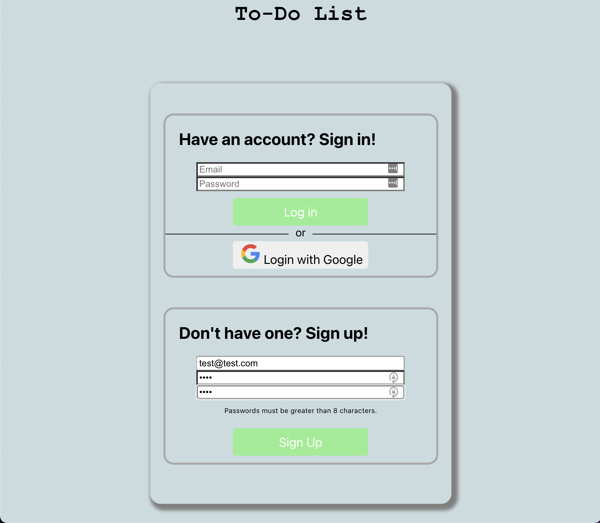

If instead the passwords do not match, this is the error message they see.

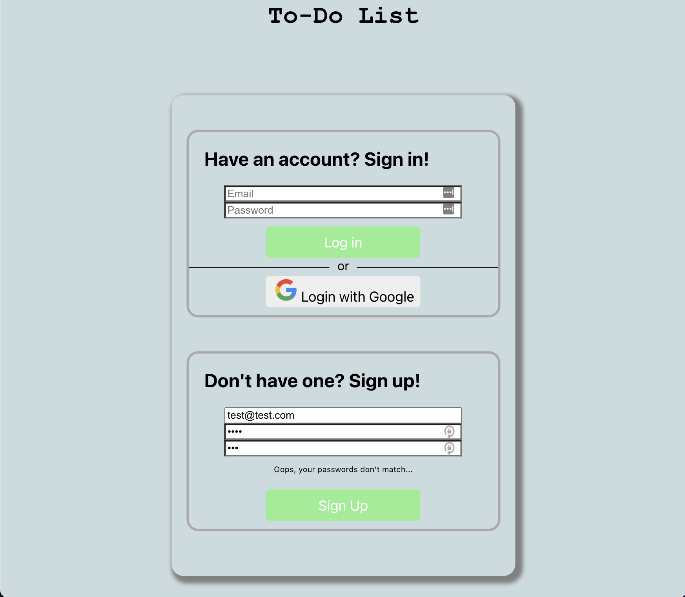

When the user creates their account,this is the page that they see. Observe that we moved the title of the application to the left of the screen, so that there is ample space for the user to be able to see their username in the top right. Additionally, observe that there is now an extra section for lists that are shared with the user. Both lists can be sorted by name and creation date (ascending and descending).

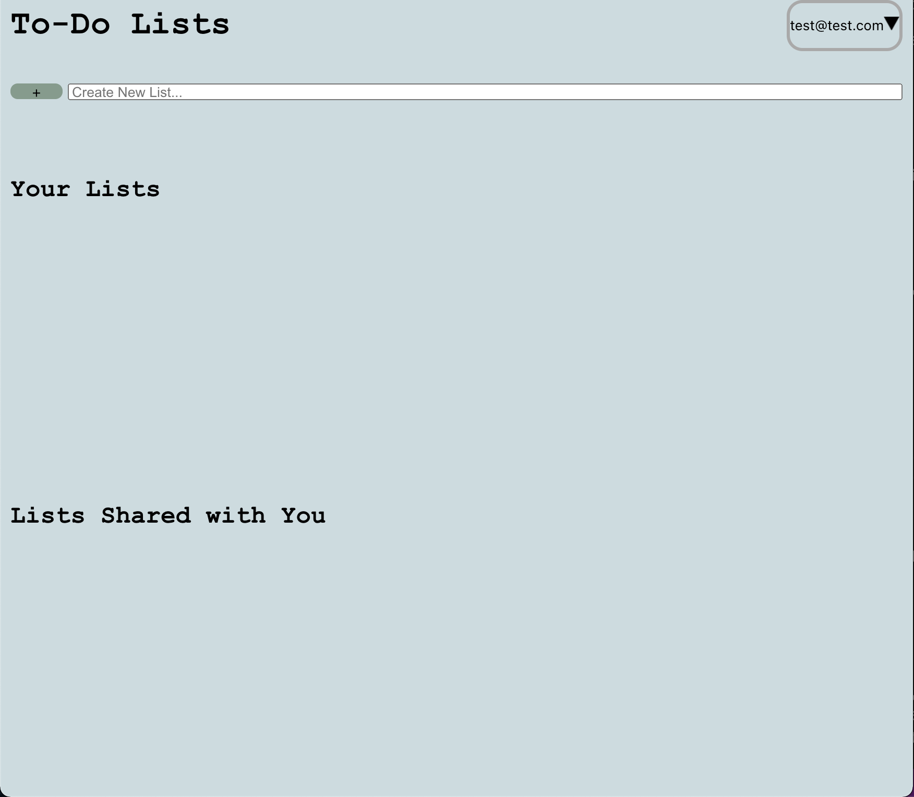

If the user clicks the drop down triangle in the top right corner, this is what they would see. These are options to log out and/or verify their account if they need.
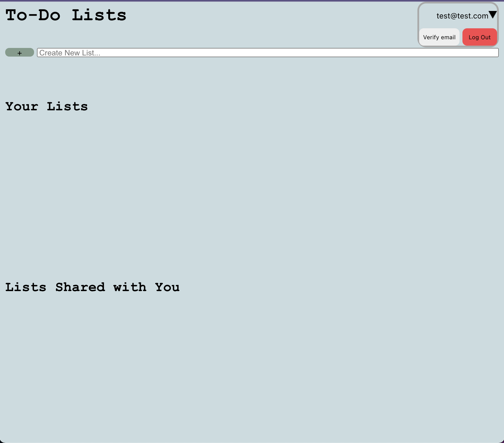

If the user created a list, this is what they would see. The main difference here is that there is now a button that the user can click to share the list with others. 

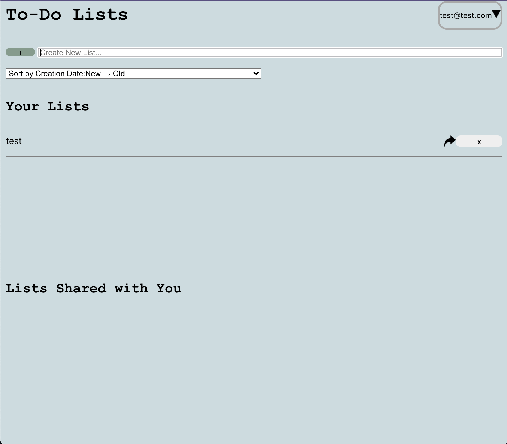

This is what the user would see if they decided to share the list. They can share the list with multiple users, and each user they want to share the list with shows up under the "Share With" section. Users that the list has already been shared with show up under the "Already Shared With" section.  

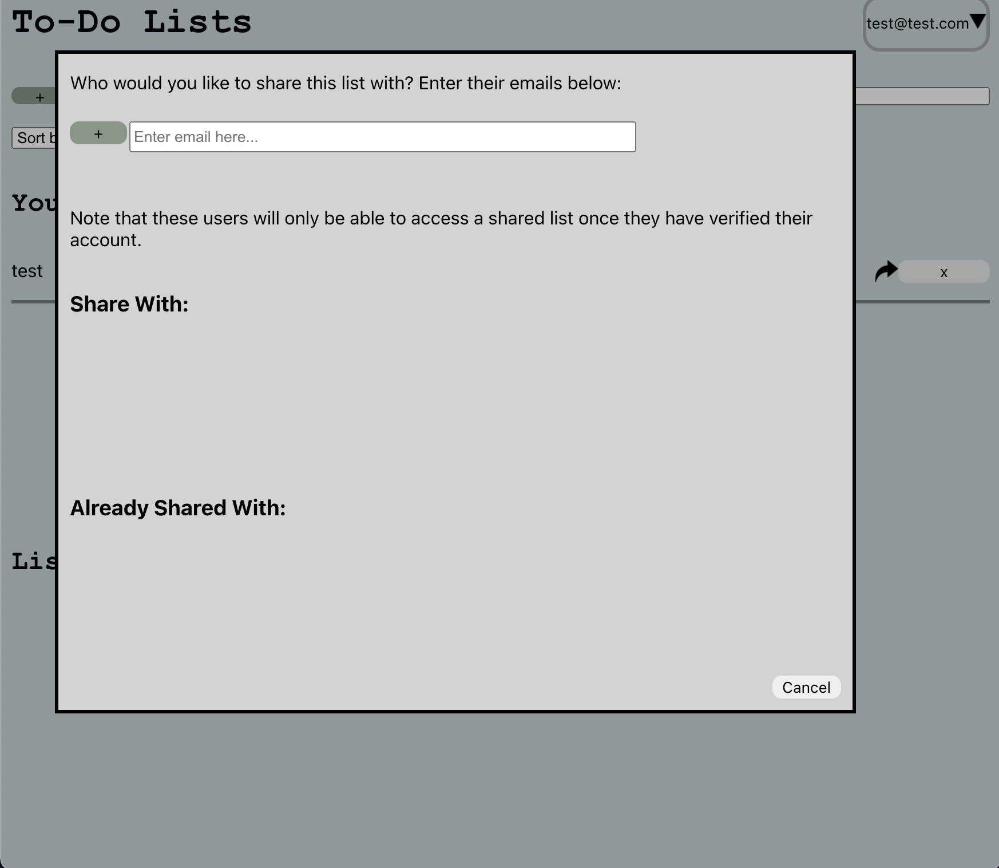

For example, if a user wanted to share a list with "anatarajan@g.hmc.edu", this is what they would see. 

Then, if they press share, the window would automatically close. When they later went to share the list with more users, this is what they would see.

If they tried to again share that list with "anatarajan@g.hmc.edu" they would see an error message as follows.

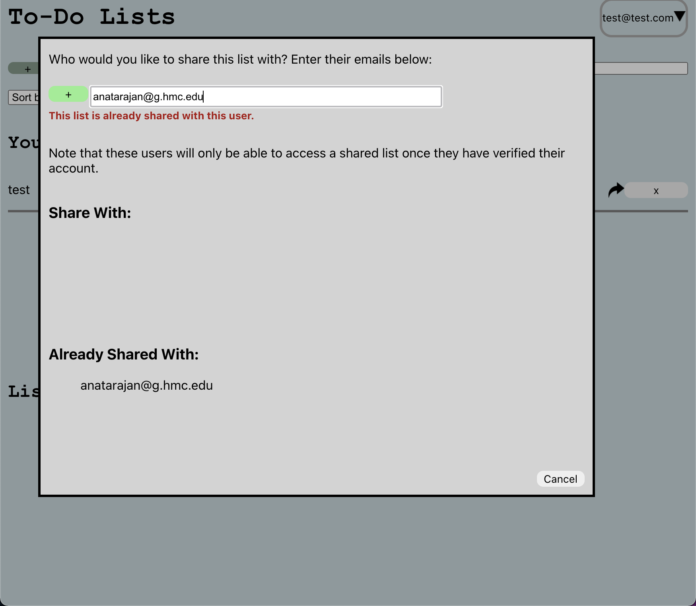

When hovering over any user in either of these sections, they would see the following. This indicates to the user that they can click on the email to remove it from the list.

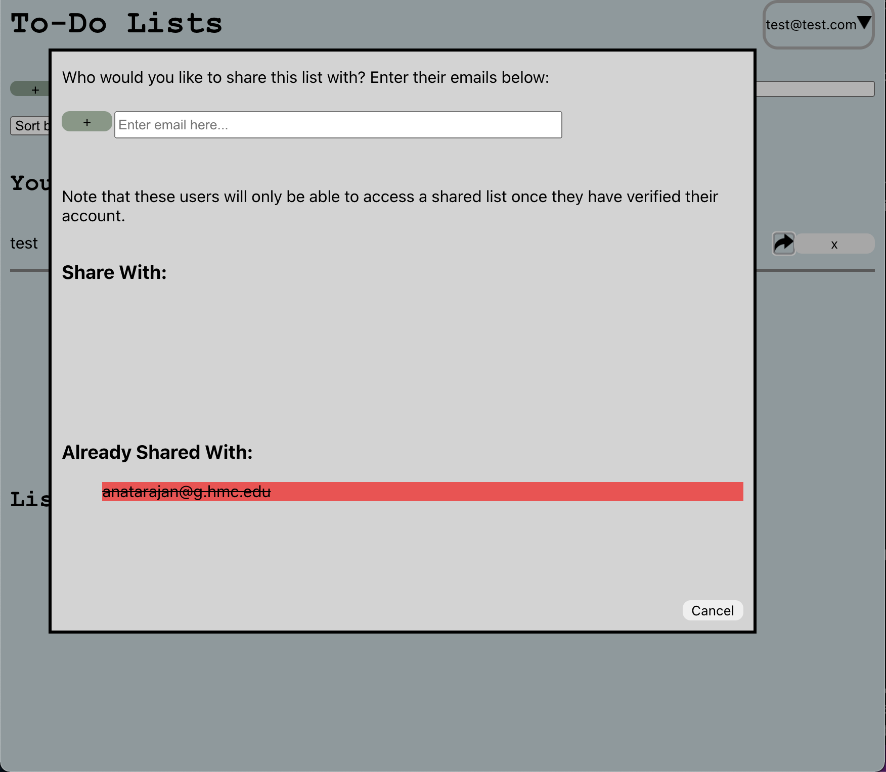

When any user who has lists shared with them logs in, they will see their shared lists as it appears below. If the press "Unshare with Me" the list disappears from their view.

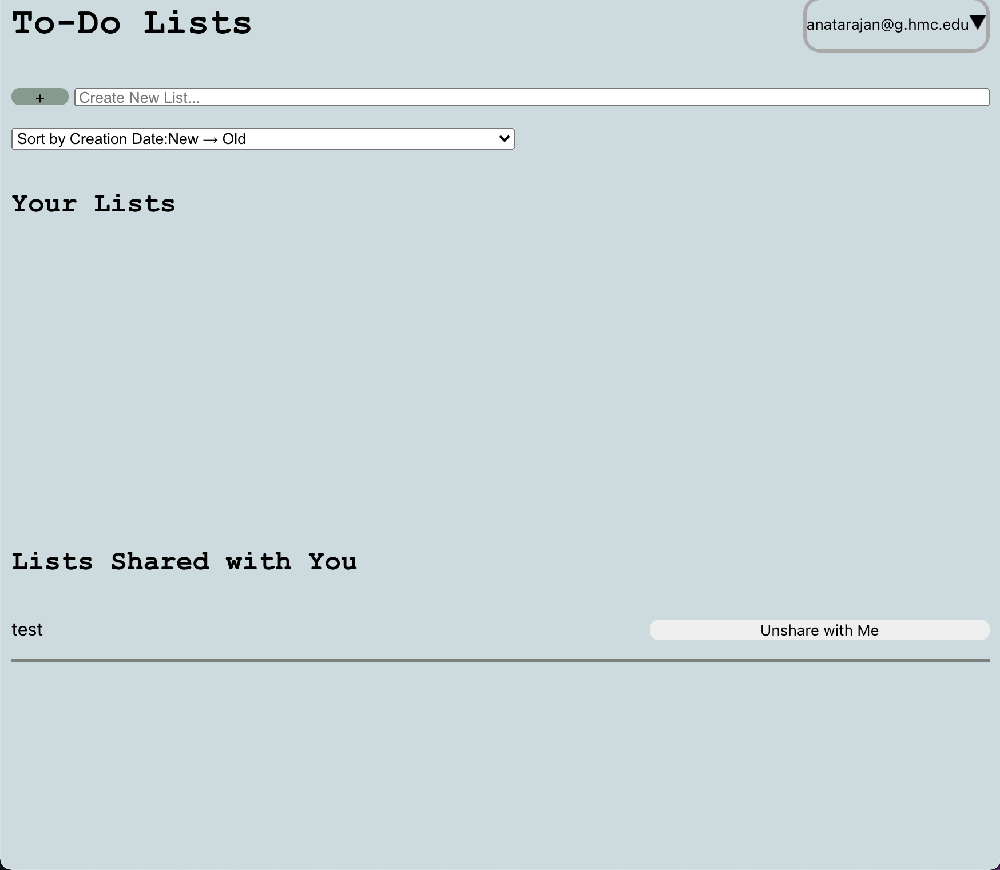

When a user views their own list, they see the following. All of this view is the same as our previous iteration, except for the fact that the sharing button is now additionally located in the top right corner. Users that are viewing a shared list have no option to share the list with others.

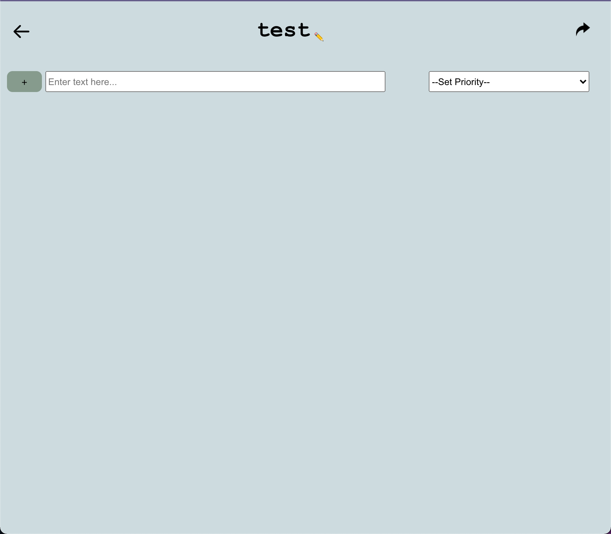

## Firebase Rules
***

    rules_version = '2';
    service cloud.firestore {
        match /databases/{database}/documents {
    function signedIn() {
      return request.auth.uid != null && request.auth.uid != null;
    }
    
    function isDocOwner() {
      return request.auth.uid == resource.data.owner;
    }
    
    function updatedDocHasCorrectOwner() {
      return request.auth.uid == request.resource.data.owner;
    }
    
    function updatedDocHasSameOwner() {
      return resource.data.owner == request.resource.data.owner;
    }
    
    
    function isSharedWithMe() {
      return request.auth.token.email in resource.data.sharedWith;
    }

    match /People-NoAuthenticationNeeded/{person} {
        allow read, write: if request.time < timestamp.date(2021, 12, 10);
    }
     match /lists/{list} {
        allow read, write: if request.time < timestamp.date(2021, 12, 10);
    }
    match /lists/{list}/to-do-list/{listItem}{
    	allow read, write: if request.time < timestamp.date(2021, 12, 10);
    }

    match /lists5/{list} {
      allow read: if signedIn() && (isDocOwner() || isSharedWithMe());
      allow create: if signedIn() && updatedDocHasCorrectOwner();
      allow update: if signedIn() && (isDocOwner() || isSharedWithMe()) 
      	&& updatedDocHasSameOwner();
      allow delete: if signedIn() && isDocOwner();
    }
     match /lists5/{list}/to-do-list/{listItem}{
      allow read, write: if signedIn();
    }

  }
}

## Challenges
Our main challenges were not only understanding but creating the appropriate Firebase rules.

## Pride Points

We are most proud of the share screen that we created. In this view, users are able to share a list with multiple users at once, and can see everyone who the list has already been shared with. They are also able to delete individual users from the sharing. We are also proud of the fact that we check the inputs that the user submits to verify that it is a valid email, and that the user is not sharing the list with themselves or someone who the list has already been shared with. We are also happy with the way users can remove themselves from lists that have been shared with them. 
