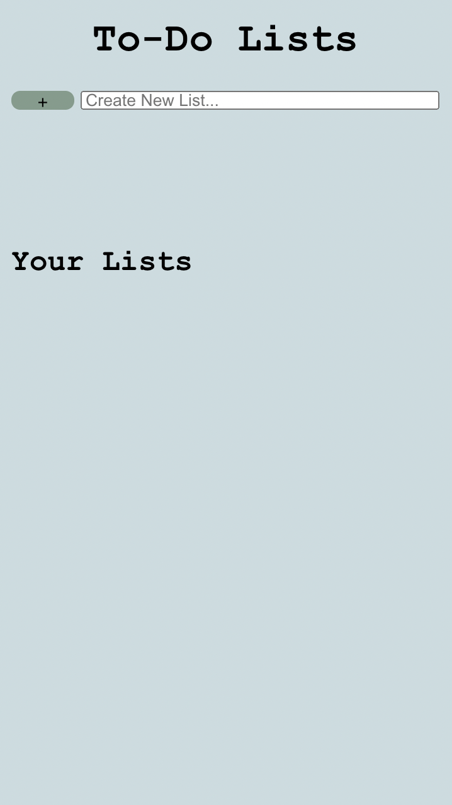
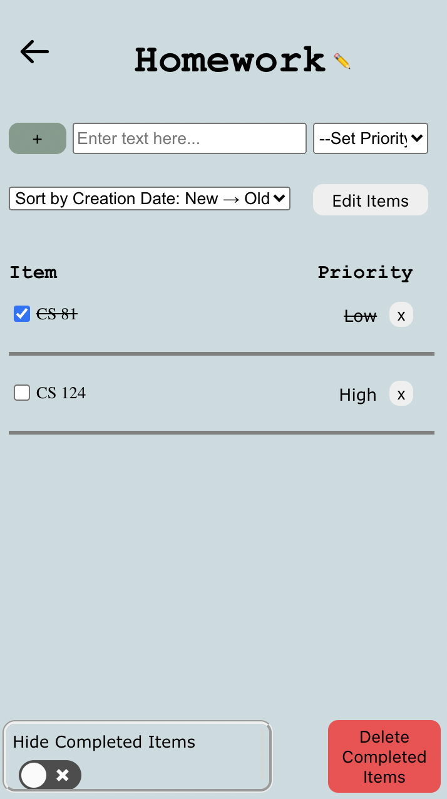
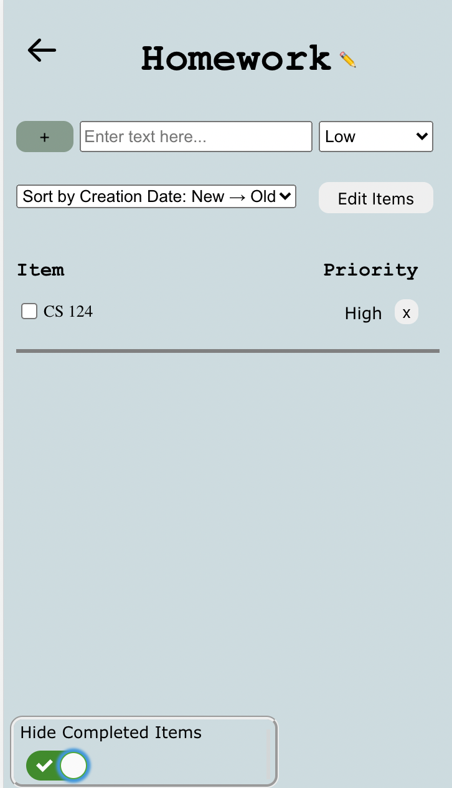
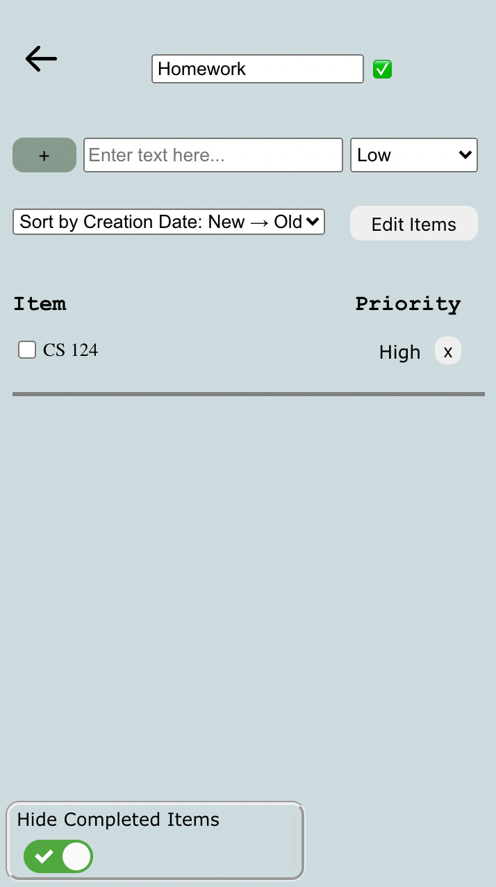

# Lab 4 Design Document 

## Design Decisions

Our intial mockup for our design is shown below:

<!--  -->

Picture (1) is what the empty to-do list would look like. For the empty list we want to add constraints by hiding all the actions other than adding an item to the list. This simplifies the experience for the user and also avoids errors of them potentially trying to edit, delete, or hide non-existent items of the list. Additionally, it highlights the only available action, of adding tasks to the list.

Picture (2) shows what the to-do list would like like after at least one task is added. With tasks on the to-do list, the user should be able to check them off, edit the names of the list, and hide/delete completed items. We want to group the "Edit List" button near the button to add items to the list because they serve similar functions. Similarly, we group the "Hide Completed Items" and "Delete Completed Items" buttons because they serve a similar purpose. However, we want the "Delete Completed Items" to be red because it is a permanent and potentially harmful action than any of the other buttons.

Picture (3) shows what happens if the user presses "Edit List". At this point, the field and button to add new items from the list, as well as the hide and delete buttons, disappear to indicate that the purpose of this button is to edit existing items on the to-do list. The label of this button also changes to "Save Changes".

Picture (4) depicts what happens if the user pressed "Delete Completed Items". This opens up a warning screen over the list, informing the user that they are about to permanently delete completed tasks. It asks the user to confirm or deny that this is the desired action.

Picture (5) shows what the list looks like after the "Hide Completed Items" button is pressed. The layout remains unchanged, except the button changes from "Hide Completed Items" to "Show Completed Items".

## Alternative Design Considerations

The main alternative design choice that we discussed had to do with how we should display multiple lists in the main page of our app. One idea was to have tabs in the app that the user could click on to maneuver between different to-do lists. However, we decided that it was better to display the list names vertically and highlight/bold a list while it is being hovered over, to indicate that the user can click on it.

## User Testing

For user testing, we showed the application to a friend of ours and asked them to create new lists and add items in each of them, while marking a couple as complete and then hiding/deleting them. During this testing, we learned that our button for hiding completed items was not easily understandable. So, we switched to using an animated toggle to indicate whether the list is currently hiding completed items or not.

For accessibility testing, we had a friend of ours to try using our application while closing their eyes and using only the keyboard. From this testing we discovered that we needed to fix descriptions for the deletion of list items, editing of a list's name, and the back button for going back to the main page.

## Final Design

Below we see what the screen looks like when no lists have been created. The add button is dimmed when there is no input in the textbox. 

Now, we see what the screen looks like when the user has created multiple lists. As before, when there is input to the textbox, the add button brightens to notify the user that they can add the item. Additionally, for non-mobile users, the list names get highlighted and underlined when hovered over.

This is what the user would see if they select the "Homework" list. Here, you can see the updated Hide Completed Items toggle, which is an improvement based on user testing. The user can see the list name at the top of their screen, and can edit it by clicking the pencil icon. Also, they can use the back arrow at the top left to navigate back to the main page with all of their to-do lists.

If a user toggle the Hide Completed Items option on, the toggle shows a checkmark and the completed items fade away. Also, we added lines between items to more clearly separate them. Also, when editing an list item, if the item changes position in the list due to sorting, it will scroll into view. We also fixed the cursor to works properly.

This is what the user sees if they click on the pencil icon to edit the list name. 

[Click here](https://youtu.be/KlwYgEHD32k) to view the demostration of our app using the screen reader.

[Click here](https://youtu.be/Bq7MhzmsT9s) to view the demostration of our app using only the keyboard.

## Challenges
We had a few challenges this week with responsive design and meaningful user interface. Because we added lost of functionality (a main page with all of the list names, new buttons for navigation, a new toggle button, etc.) this week, we needed to make sure that all of the extra graphics fit within screens of different sizes. This took some time, but we decided to use a combination of flex boxes, alignment commands, and media queries to ensure that our application was usable for the different sizes. 

Another challenge we ran into was ensuring that the application was compatible and easy to use with a screen reader. We did user testing, and tested the app extensively ourselves in attempts to make it as compatible as possible with keyboard and screen reader users.

## Pride Points

We are most proud of our thoughtfulness and incorporation of ideas as to how a user would actually want to interact with this product. For example, the user can select a priority for a task when creating it, but they are not forced to do so. The attention to detail in ensuring that the menu elements in the top two rows are all aligned are also things we are proud of.

We are proud of the flow for deleting  items. We put some thought into this flow, and as a result made the "Delete all Completed Items" button red and created a pop-up window so that the user would have to confirm that they really wanted to delete their items. Additionally, when the user deletes or hides completed items, they slowly fade out rather than immediately disappearing. Moreover, on the desktop, if a user highlights over the X button to delete an item, it turns red just as the delete all completed items button is, which creates a unified design language that is understandable. 

We are also proud of our user testing. Through user testing, we were able to make our application more accessible to keyboard and screen reader users. Additionally, we gained valuable ideas about how the sizing of our graphics should respond to different screen sizes.
