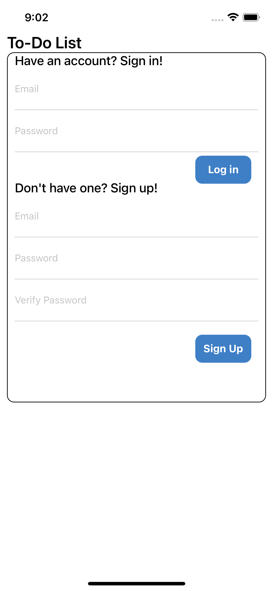
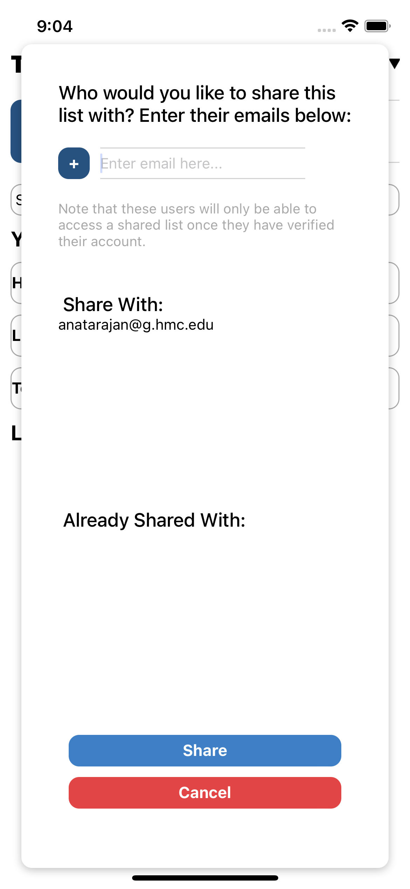

# Lab 6 Design Document 

## Design Decisions

This is an iOS application built with React Native. It is intended to have a very similar design to its Web app counterpart, to provide consistency to the user. 

## Alternative Design Considerations
Our main alternative design consideration was whether to completely redesign the application or to make it similar to our previous iterations of the web application. We decided that making it as similar to the web application as possible, while maintaining functionality for this form factor, would be the most effective design. 

## User Testing

For user testing, we showed the iOS simulator to a friend and one of our parents. We observed that since this was a mobile application, users had the tendency to make many taps to discover what actions were supported. This aligned with our expectations and supported our decision to remove the "Edit Items" Button (detailed below). Our other design decisions were also well supported by user testing, and we did not find any significant design flaws.

## Final Design

Below we see what the login screen looks like. Although the web application has login using Google, we were unable to successfully implement this on mobile. As before, when creating an account, we ensure that the user creates a secure password.

Once logged in, this is what the user would see. This design is nearly identical to the web application. When there is no text in the text input, the button is a darker blue and disabled, and it brightens when the user is allowed to create a list.

To log out and/or verify their account, the user can click on their account name and the following two buttons will appear. 

Now, if the user creates a few lists, they would see the following. They can press the X button to delete any of the lists, the arrow to share the list, or click on the list name to go to the list. In our web application the X button turned red on hover, but since there is no hovering on mobile, we decided to have it always be red. They can also sort these lists by creation date and name.

If the user presses on the arrow to share, the following screen appears, showing a list of emails the user would like to share the list with, and a list of emails that are already shared.

When looking at a list and its tasks, the user would see the following. The main change from the Web application is the removal of the "Edit Items" button. Since this is a mobile application, users are already used to pressing on and being able to edit it, so we decided that we did not need to a dedicated button to enable editing. Instead, the user can always tap on the task name or its priority and edit them. 

If the user marks a task as complete, a switch to hide completed items and a button to delete completed items appear, as follows.

If the user then decided to delete completed items, they are shown the following warning. We intentionally made the Confirm option red to indicate that it is destructive.

## Challenges
We had many challenges in create this application. First, learning React Native was difficult. Although it is similar to React, there are a large number of differences. It was difficult to understand how platform support worked in React Native and we had some difficulties with the iOS Simulator. There were also challenges finding useful/up-to-date libraries, such as for the priority and sorting drop-down menus. 

## Pride Points

We are most proud of our consistency between the web and mobile versions of this application, yet our ability to take advantage of each platform's specific nuances/ use cases. The consistency in our design makes it easy for users to go back and forth between both versions, and both designs are extremely simple and understandable. 

Specific to this app, we are very happy with our choice of color for buttons and actions. Consistently throughout the app, blue buttons are additive or non-harmful, whereas red buttons are destructive. This consistency again allows users to better understand what buttons may do if they are confused.
